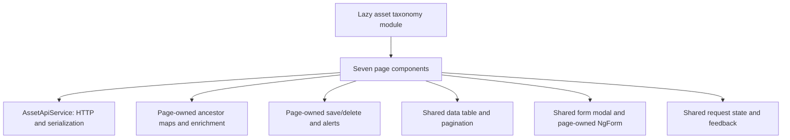

# DARP asset taxonomy architecture review

Reviewed on **2026-10-10 (Asia/Tehran)** against the seven current pages and their shared dependencies. Final source baseline: `0a9d3d1` (`remove spec`). This is a source study and proposed refactoring plan; application code was not changed.

The feature has a useful foundation: one lazy-loaded feature module, centralized HTTP access and entity models, shared Metronic table/modal presentation, reusable validation, immutable table rows, and cancellation/duplicate-mutation guards. The main maintenance burden is repeated orchestration inside page components.

Keep the seven recognizable pages. Extract shared behavior through composition, with explicit page-specific forms and payloads. A universal CRUD page or a large base-component inheritance hierarchy would make the differences harder to follow.

## Current structure and size

Counts include blank lines and comments, excluding trailing blank lines. They describe the seven component files and templates, not the entire feature dependency tree.

| Page | TypeScript lines | Template lines | Current responsibilities and strongest opportunity |
| --- | ---: | ---: | --- |
| Site | 195 | 180 | Direct CRUD, six fields, numeric elevation and coordinate sorting. Retain the explicit form; share alerts and mutation handling. |
| Plant | 336 | 247 | Plant CRUD, Plant Type CRUD, Site/type/employer options and employer assignment. Remove duplicate employer arrays and share mutation handling; consider a focused type-management child. |
| Unit | 249 | 126 | Plant options, inherited employer and Unit CRUD. Merge the identical `loadUnits()` and `loadUnitsOnly()` implementations first. |
| System | 267 | 126 | Unit options, Unit-to-Plant mapping, inherited employer and System CRUD. Move hierarchy lookup/enrichment out of the page. |
| Asset | 291 | 130 | System options, two ancestor maps, inherited employer, Tag and CRUD. Reuse the hierarchy service and shared mutation behavior. |
| Component | 298 | 130 | Asset options, three ancestor maps, inherited employer, Tag and CRUD. Reuse the hierarchy service; clarify Angular decorator/entity aliases locally. |
| Measurement | 462 | 289 | Component options, four ancestor maps, inherited employer, types/units/sensitivity, Tag and two CRUD workflows. Highest-priority page for reducing orchestration. |
| **Total** | **2,098** | **1,228** | **3,326 lines in page TypeScript/templates.** |

All seven component stylesheets are empty or whitespace-only. Styling is already supplied by Metronic and shared adapters; CSS duplication is not the main issue.

Current ownership:



The hierarchy and mutation boxes are the best extraction targets. [Angular 18's style guide](https://v18.angular.dev/style-guide/#delegate-complex-component-logic-to-services) recommends moving reusable non-presentation logic into services.

## Recommendations, in implementation order

### 1. Make the small, unambiguous reductions first

- `unit/unit.component.ts:136` and `:223` contain identical loader bodies. Keep one `loadUnits()` and call it from initial loading and successful mutations.
- All seven `showAlert()` methods have identical bodies, each spanning 12 lines: Site `:183`, Plant `:324`, Unit `:237`, System `:255`, Asset `:279`, Component `:286`, Measurement `:450`. Move SweetAlert presentation into one `MetronicAlertService` under `src/app/core/services/`. Keep entity-specific messages at the call site.
- Plant's `employers` and `employerUsers` are assigned the same response and serve the filter and form respectively. One clearly named array can supply both, while retaining the selected employer ID and display-name snapshot behavior.
- Unit/System/Asset declare public delete wrappers, but their templates call `table.confirmDelete()` directly. Remove unused wrappers after a repository reference check, or consistently use them. Site and Plant currently use their wrappers; avoid keeping two equivalent patterns accidentally.
- The templates contain **273 standalone marker-comment lines**, such as `begin::Label` and `end::Label`. Keep useful section headings and comments explaining unusual behavior. Remove repetitive markers in application templates, while preserving actual `data-kt-*` attributes, selectors and plugin hooks.

These changes have low conceptual cost and immediately make navigation easier. Extracting a shared alert service saves substantially fewer than 84 net lines once its implementation and imports are counted; evaluate total code, not only shorter page files.

### 2. Centralize hierarchy loading and employer inheritance

Evidence: System `:105`, Asset `:108`, Component `:106` and Measurement `:136` each reconstruct overlapping parent-ID maps. Unit also maps Plants to employers. Component and Measurement have identical System, Unit and Plant loader bodies after whitespace normalization.

Measurement's main-list chain is:

```text
Assets -> Systems -> Units -> Plants -> Components -> Measurements
```

That is six sequential GETs. Measurement Types and employer users are two additional independent reads started during initialization. The GETs in the hierarchy chain use the existing fixed all-rows query; later requests do not need IDs from earlier responses. The dependency is in enrichment, so the requests can run concurrently and their results can be combined afterward.

Add a focused `AssetTaxonomyHierarchyService` under `src/app/core/services/`. Its public methods should be easy to understand, such as `loadSystemContext()`, `loadAssetContext()`, `loadComponentContext()` and `loadMeasurementContext()`. Share internal map/option construction and employer resolution. Load only the ancestor collections a page needs; do not fetch the whole taxonomy for every screen.

Use pure, typed functions for repeated transformations such as parent options and ID indexes. `Map<number, number>` or `Partial<Record<number, number>>` expresses potentially missing relationships more honestly than `Record<number, number>`, which declares every numeric key present.

For finite HTTP reads, an object-form `forkJoin` can combine the required collections. It waits for all inputs, and one error fails the group and unsubscribes the others; preserve contextual failure messages and the current separate optional-employer feedback. See the [RxJS 7.8 implementation and documentation](https://github.com/ReactiveX/rxjs/blob/7.8.1/src/internal/observable/forkJoin.ts). Continue to cancel superseded reads and reads from a destroyed page through the existing request-state/lifecycle pattern.

Publish the derived context only once its necessary reads succeed. Recompute inherited employer IDs/names from the Plant snapshot, preserve hierarchy-label fallbacks and sorted options, and retain the current mutation-specific list refreshes. This reduces duplicated logic and request waterfall latency; it does not reduce the number of endpoints or establish an atomic backend snapshot.

Start without a cross-route cache. A cache would need explicit invalidation for changed ancestors, employer assignment and type labels; adding it prematurely creates another maintenance problem. No new endpoint or browser storage is needed for this extraction.

### 3. Share mutation mechanics through a small composable helper

Nine save workflows repeat the same sequence: guard, mark saving, choose create/update, cancel on destruction, close on success, alert, reload, and retain the form on failure. Nine confirmed-delete handlers repeat per-row locks, cancellation, finalization and notifications.

A small mutation controller can own the repeated mechanics. Keep these responsibilities in the page:

- Validation and unavailable-parent/type checks.
- Explicit payload construction and the choice of existing API method.
- Entity-specific messages.
- Which lists need refreshing after success.

Give each page its own controller instance. A root singleton must not share `saving` or use its root `DestroyRef` as a substitute for page lifetime. If implemented as an injectable service, place the implementation in `core/services/` and provide it at the page level. If implemented as a plain helper, pass the page's lifetime explicitly.

Preserve a subtle existing behavior: saving is cleared **before** calling `modal.dismiss('saved')`, because `beforeDismiss` blocks dismissal while saving. Also retain the shared shell's Escape handling, disabled Close/Cancel/Submit, failure retry values, ID-based deletion locks, and `finalize()` cleanup.

Keep Plant Type and Measurement Type successful writes refreshing both the type list/options and their related main list. A generic helper that refreshes only its own table would reintroduce stale joined names/units.

### 4. Reduce repeated validation presentation without hiding form registration

`unit/unit.component.html:88` shows the repeated pattern: the same invalid/touched/submitted predicate drives CSS, `aria-invalid`, error descriptions and the message. That pattern occurs throughout the nine forms.

A narrowly scoped validation-feedback directive and error-message component could centralize the presentation under `shared/components/form-validation/`. Leave native inputs/selects and their `ngModel` bindings in the page so NgForm registration and the Select2 integration remain easy to follow. Test submitted/touched timing, required versus optional fields, and the visible Select2 combobox's ARIA state.

Avoid turning every field into a new custom value accessor merely to reduce markup. Encapsulating controls can introduce ControlContainer/CVA work and hide field behavior. Template-driven forms are reasonable for these small forms. Typed reactive forms are an option if dependencies and validation become more complex, but would be a separate migration and may add code. Angular's [typed forms documentation](https://v18.angular.dev/guide/forms/typed-forms/) confirms the extra typing applies to reactive forms.

### 5. Give templates smaller reusable presentation pieces where they help

The seven searches repeat the same magnifier/input markup; nine cards repeat title/toolbar/body markup. A shared Metronic search input or projected card shell can reduce duplication while keeping the filters and forms explicit. Place new reusable components under `src/app/shared/components/`.

Consider extracting a dedicated type-management panel from Plant/Measurement after mutation behavior is simplified. Plant Type is Name-only; Measurement Type is Name plus Unit. A small shared presentation shell or two focused implementations is easier to follow than a schema-driven editor with many mode flags. A page-specific child stays with its page; an actually reusable child belongs under `shared/components/`.

For lists refreshed with new objects, track options by ID and table columns by key. Use `*ngFor` with `trackBy`, or Angular 18 `@for` with explicit tracking when touching those templates. This can reduce DOM replacement and Select2 observer work; it is not a measured performance result from this study. Changing all control-flow syntax solely for modernization is lower priority.

### 6. Make change detection deliberate

There are **59 `cdr.detectChanges()` calls** across the seven page files. The pages use default change detection, while the root `AppComponent` explicitly uses `OnPush`. Select2 also crosses Angular zone boundaries. Therefore, these calls cannot be classified as unnecessary from source inspection alone.

Prefer a consistent state-to-view mechanism: template-read signals for observable page state, or observable view models with `AsyncPipe`. Where ordinary fields remain, assess `markForCheck()` for scheduled updates. Consider page/shared-component `OnPush` only after the state path is explicit and modal/plugin behavior is verified. Angular documents the distinction in [change-detection configuration](https://v18.angular.dev/guide/components/advanced-configuration/#changedetectionstrategy).

Retain targeted synchronous detection if an integration actually needs it. Removing all calls or adding `OnPush` everywhere without checking loading/error, async options, modal close and row locking would be a behavior change, not simple cleanup.

### 7. Keep HTTP access explicit; extract only repetitive transport code

`AssetApiService` is centralized and unwraps business failures into observable errors. Its create/update methods explicitly serialize permitted fields, preventing joined/audit data from leaking into requests. Those are valuable boundaries.

Private typed `getPage<T>()`, `postVoid()`, `putVoid()` and `deleteVoid()` helpers could reduce repeated URL/envelope plumbing while preserving named public methods. Keep entity-specific field serialization explicit. Do not replace the service with an unrestricted `save(entityName, entity)` API or send full entity objects.

The current service asks for `take: 10000` and discards `totalCount` when returning `items`. Consequently, a dataset larger than that limit may yield an incomplete visible list and incomplete ancestor resolution. Dataset sizes and a live occurrence were not checked. Document the cap and, if those sizes become realistic, preserve total-count information for a truncation notice or coordinate a supported pagination design with the backend team. It is not a blocker for this UI refactoring and does not justify inventing an endpoint.

## SOLID, DRY and KISS assessment

| Principle | Application to this feature |
| --- | --- |
| Single responsibility | Strongest opportunity: pages mix presentation, hierarchy reconstruction and mutation mechanics. `TablePagination` also mixes table state with SweetAlert confirmation/local-delete feedback. Consider moving confirmation into a focused service while leaving state/row locks in the helper. |
| Open/closed | Existing typed column definitions and projected form shells already support variation cleanly. Extend with small collaborators rather than a central switch over every entity. |
| Liskov substitution | No feature inheritance hierarchy currently needs correction. Avoid introducing a base page requiring special exceptions for Site, Plant and Measurement. |
| Interface segregation | Keep collaborators narrow: hierarchy context, notification presentation and mutation lifecycle. Avoid a service that exposes every form, modal and table operation together. The existing pagination-only interface is a useful example. |
| Dependency inversion | Pages already use Angular injection for HTTP/modal dependencies. Move SweetAlert dependence out of page/state code where useful. Add injection tokens or abstract ports when real interchangeable implementations are needed, rather than interfaces that have no runtime purpose. |
| DRY | Extract repeated knowledge: employer inheritance rules, request lifecycle and validation feedback. Some explicit entity-specific fields/payloads are useful repetition because they make contracts reviewable. |
| KISS | Preserve straightforward pages, existing NgModules/NgForm, Metronic and established integration behavior. A new store library, generic CRUD framework, universal dynamic form or deep inheritance tree is not needed. |

Preserve the user's established **one model per entity** in `core/models/asset-taxonomy.model.ts`. Optional IDs and nullable form selections explain the repeated narrowing. Standardize `id !== undefined` and selection null checks instead of mixed truthiness checks, which embed an undocumented nonzero-ID assumption. Plant/Measurement currently differ from Unit/System/Asset in these checks. Positive production IDs were not independently verified, so this is a consistency/type-safety finding rather than a confirmed live failure.

Keep canonical `Component` and `Measurement` names. A local entity import alias can resolve Angular's decorator name collision without renaming the shared models. Also use a typed modal template context in place of the **18 `TemplateRef<any>` occurrences**, and give error handling a common `unknown`-to-message function if mutation handling is extracted.

Use a consistent page order: configuration; state; derived availability; initialization/cleanup; reads; filters; modal opening; saves/deletes; pure helpers. Standardize names such as `table`, `formModel` and `loadRows` where their meaning stays clear; retain explicit names for the second table/form on Plant and Measurement.

## Reduction expectations and acceptance

The hierarchy and mutation extractions should provide the largest meaningful reduction in page TypeScript. Measure both the seven pages and every new shared file afterward; moving code elsewhere is a separation improvement, but is not itself a net code reduction. No percentage reduction is claimed without an implemented prototype. Removing all 273 marker-comment lines alone would reduce template line count by about 22%, but changes no executable logic or runtime bundle behavior.

Recommended sequence:

1. Consolidate Unit loading, alert presentation, unused wrappers and duplicate employer state.
2. Extract and verify hierarchy context/enrichment; parallelize its independent reads.
3. Extract mutation mechanics, retaining explicit payloads and refresh policies.
4. Centralize validation presentation and selectively extract search/card/type panels.
5. Reassess signals/AsyncPipe, change detection and transport helpers after those boundaries are stable.

For behavior-changing extractions, verify cancellation, failed reads/retries, immutable edit isolation, numeric IDs and zero values, optional employer clearing, empty Tags, type-name/unit refresh, duplicate deletion suppression, and modal save/dismissal rules. For visual extractions, check Metronic light/dark appearance, mobile overflow, focus/keyboard access and Select2 cleanup. Add focused regression tests around changed behavior; no new tests were added for this source-only study.

## Validation and limits of this study

- `npm run build`: passed with strict Angular template checking. Initial bundle approximately **2.77 MB**, above the existing warning budget; four existing CSS selector optimization warnings remain. The taxonomy lazy chunk is approximately **139.66 kB** raw / **16.18 kB** estimated transfer; page-source cleanup should not be presented as solving the application's initial bundle warning.
- `npm run lint`: passed.
- `npx tsc --project tsconfig.spec.json --noEmit`: passed for the test sources present when it ran.
- Final source inventory: no page specs remain under `pages/asset-taxonomy/`, and no taxonomy API spec remains under `core/services/`. During this review, the existing three page-level spec deletions and the API spec removal were committed as `0a9d3d1`; the review did not restore or modify them. Shared table/pagination, form-modal, request-state and Select2 specs remain. Historical page/API test pass counts in `agent.md` do not establish current coverage.
- Source inspection and TypeScript AST comparisons verified the counts and duplicate method bodies. Browser tests, manual visual review, live API integration and performance measurements were not run for this study.
- API contracts, application behavior, persistent storage, dependencies and visual styles were not changed. New service/component names above are proposals, not existing implementations.
